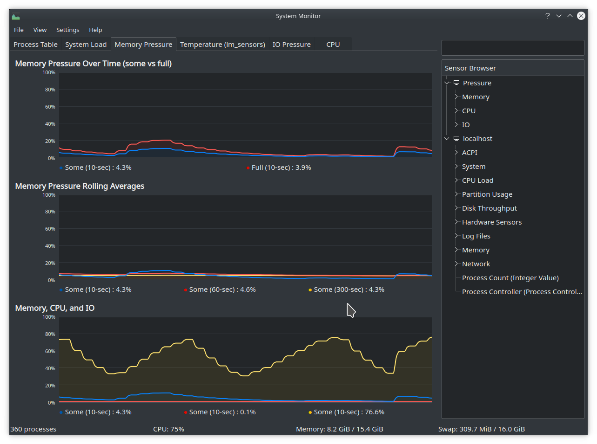

# MemPressure

**NOTE** This project is lo longer maintained due to this sensor data being [merged into KDE Plasma 6.1](https://invent.kde.org/plasma/ksystemstats/-/merge_requests/72).

A simple perl script that acts as a KSysGuardd remote machine to display memory pressure information from /proc/pressure on kernels that support it (5.0+).

A screenshot of KSysGuard showing repetitive patterns of high IO pressure caused by baloo_file_extractor

## Usage:
 1. Clone this repo
 2. Run `generate.sh` to generate an `.sgrd` file. 
 3. In KSysGuard's menu, open "File > Import Tab From File option" and import the generated file.

## Manual Setup
You can also set up the sensors by themselves by adding a new remote machine to KSysGuard with the "custom script" option set to the full path to `pressure-sensor.pl`.

## Notes

This setup relies on the location of `pressure-sensor.pl` being constant. So be sure to move it to wherever you want it _before_ following any set up steps. `generate.sh` uses the `pwd` command to tell KSysGuard about the location of the sensor script.

## Future Improvements

- [ ] theres a lot of very simiar code to get the values from the double-nested Hash. May be nice to find a way to simplify this so that it returns the value on the fly when receiving a command from ksysguard? (i.e. it determines the value to return based on the name of the sensor entered)
- [ ] potentially create a new system tray widget for displaying this data or integrate it into an existing widget (see: https://zren.github.io/kde/docs/widget/)
- [ ] add some kind of external logging
- [ ] I dont know if there's any performance penalty for reading from `/proc` many times per second as KSysGuard will probably do if you have the refresh frequency super high and many many graphs, but it would be nice to try and optimize the performance and memory usage of this so that it maybe does a tiny bit of caching to avoid fetching the full data from `/proc` and throwing it away after using just one value when there may be many values being polled for. 
- [ ] Maybe make this sort of thing work for the "Task manager" utilities for other desktop environments (i.e. gnome)

## Credits and Sources

based on https://gist.github.com/Sporif/4ce63f7b6eea691bdbb18905a9589169

### See Also
 - https://lwn.net/Articles/753840/ about the /proc/pressure feature
#### ksysguard
 - KSysguard sensor development https://techbase.kde.org/Development/Tutorials/Sensors
 - libksysguard https://develop.kde.org/docs/extend/sensor-faces/
 - https://bugs.kde.org/show_bug.cgi?id=58154
